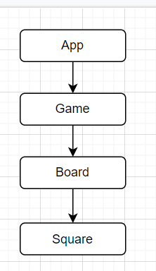

# Tic-Tac-Toe with React/Redux

## Fundamentals of Redux Three-Day Group Project

### By Jeff Chiu, Sarah Gilbert, Tawnee Harris, & Danielle Thompson

### Project began 2.16.21. Last updated 2.18.21.

---

### Get in Touch

Contact us at ...

danithompson74 at gmail.com | [LinkedIn](https://www.linkedin.com/in/danielle-thompson74/)

[jeffchiudev@gmail.com](jeffchiudev@gmail.com)

sarahgilbert064 at gmail.com | [LinkedIn](https://www.linkedin.com/in/sarahgilbertpdx)

[tawneeh@icloud.com](tawneeh@icloud.com) | [LinkedIn](https://www.linkedin.com/in/tawneeh)

### Known Bugs

_No known bugs at this time._

[Report bugs here.](https://github.com/tawneeh/tic-tac-toe/issues) | [Request features here.](https://github.com/tawneeh/tic-tac-toe/issues)

## Description

TODO

## Component Diagram

---

## User Stories

|  # 	|  Stories 	|
|---	|---	|
|  1 	|  A user should be able to Create, Update, Delete, and see list and details of kegs in the tap room. 	|
|  2 	|   Decrease kegQuantity remaining per keg when a pint is purchased. For instance, if a user clicks "Buy", the quantity will decrease by one.	|
|  3 	|   When the quantity of an keg is reduced to 0, the keg should say "Out of Stock". A user should not be able to reduce the quantity of a keg below 0.	|
|  4 	|   When the quantity of an keg is reduced to 0, the user should be prompted with the option to restock the keg.	|
|  5 	|   When there is a keg in the inventory that is extra expensive, the user should see the details of the keg listed in red font, not black.	|
|  6 	|   Kegs should have fields for name, brand, price, alcoholContent.	|
|  7 	|   A user should be able to see how many pints are left in a keg.	|

---

## Stretch Goals

- Implement more CSS/CSS objects
- Display the location for each move in the format (col, row) in the move history list.
- Bold the currently selected item in the move list.
- Rewrite Board to use two loops to make the squares instead of hardcoding them.
- Add a toggle button that lets you sort the moves in either ascending or descending order.
- When someone wins, highlight the three squares that caused the win.
- When no one wins, display a message about the result being a draw.

## Technologies Used

- [VS Code](https://code.visualstudio.com/download)
- Git & GitHub
- ES6 JavaScript
- JSX
- React Framework v17.0
- Redux v4.0.5
- npm
- node.js
- `create-react-app`
- `npm install --save-exact react-scripts@3.2.0`
- `npm install redux@4.0.5 react-redux@7.1.3`
- Jest
- webpack v5.11.1
- Babel
- ESLint
- node.js v15.8.0
- Bootstrap v5.0.0

___

### Setup/Installation Requirements

- To access the live page visit ... TODO

##### Running the Project Locally

###### For Mac Users

- Access Terminal in your Finder, and open a new window. Install the package manager, [Homebrew](https://brew.sh/), on your device by entering this line of code in Terminal: `$ /usr/bin/ruby -e "$(curl -fsSL https://raw.githubusercontent.com/Homebrew/install/master/install)"`.
- Ensure Homebrew packages are run with this line of code: `echo 'export PATH=/usr/local/bin:$PATH' >> ~/.bash_profile`.
- Once homebrew is installed, install Git, a version control system for code writers, with this line of code `brew install git`.
- Now, install Node.js through Homebrew with the following command: `brew install node`.
- Confirm that node and npm (Node's package manager that is automatically installed alongside Node) are on your working system with two command lines `node -v` & `npm -v`, respectively returning something resembling `v14.5.0` & `6.14.5` (or higher).

###### For Windows Users

- Open a new Command Prompt window by typing "Cmd" in your computer's search bar.
- Determine whether you have 32-bit or 64-bit Windows by following these [instructions](https://support.microsoft.com/en-us/help/13443/windows-which-version-am-i-running).
- Go to [Git Bash](https://gitforwindows.org/), click on the "Download" button, and download the corresponding exe file from the Git for Windows site._
- Follow the instructions in the set up menu.

###### For Both Mac & Windows systems

* Once you have Git installed on your computer, go to this [GitHub repository](https://github.com/tawneeh/tic-tac-toe), click the "Fork" button in the upper right hand corner of the page, and clone this application with the following command:`git clone https://github.com/tawneeh/tic-tac-toe.git`.
* Go to the [Node.js website](https://nodejs.org/en/download/) and download the appropriate source code for your Windows operating system.
* Once the project has been cloned to your computer and you have all the necessary items on your local computer, open the project in the application of your choice.

##### Available Scripts

In the project directory, you can run:

###### `npm start`

Runs the app in the development mode.\
Open [http://localhost:3000](http://localhost:3000) to view it in the browser.

The page will reload if you make edits.\
You will also see any lint errors in the console.

###### `npm test`

Launches the test runner in the interactive watch mode.\
See the section about [running tests](https://facebook.github.io/create-react-app/docs/running-tests) for more information.

###### `npm run build`

Builds the app for production to the `build` folder.\
It correctly bundles React in production mode and optimizes the build for the best performance.

The build is minified and the filenames include the hashes.\
Your app is ready to be deployed!

See the section about [deployment](https://facebook.github.io/create-react-app/docs/deployment) for more information.

###### `npm run eject`

**Note: this is a one-way operation. Once you `eject`, you can’t go back!**

If you aren’t satisfied with the build tool and configuration choices, you can `eject` at any time. This command will remove the single build dependency from your project.

Instead, it will copy all the configuration files and the transitive dependencies (webpack, Babel, ESLint, etc) right into your project so you have full control over them. All of the commands except `eject` will still work, but they will point to the copied scripts so you can tweak them. At this point you’re on your own.

You don’t have to ever use `eject`. The curated feature set is suitable for small and middle deployments, and you shouldn’t feel obligated to use this feature. However we understand that this tool wouldn’t be useful if you couldn’t customize it when you are ready for it.

___

#### Legal, or License

This software is licensed under the [MIT License](https://choosealicense.com/licenses/mit/).

Copyright (c) 2021 *_Jeff Chiu, Tawnee Harris, Sarah Gilbert, & Danielle Thompson_*

